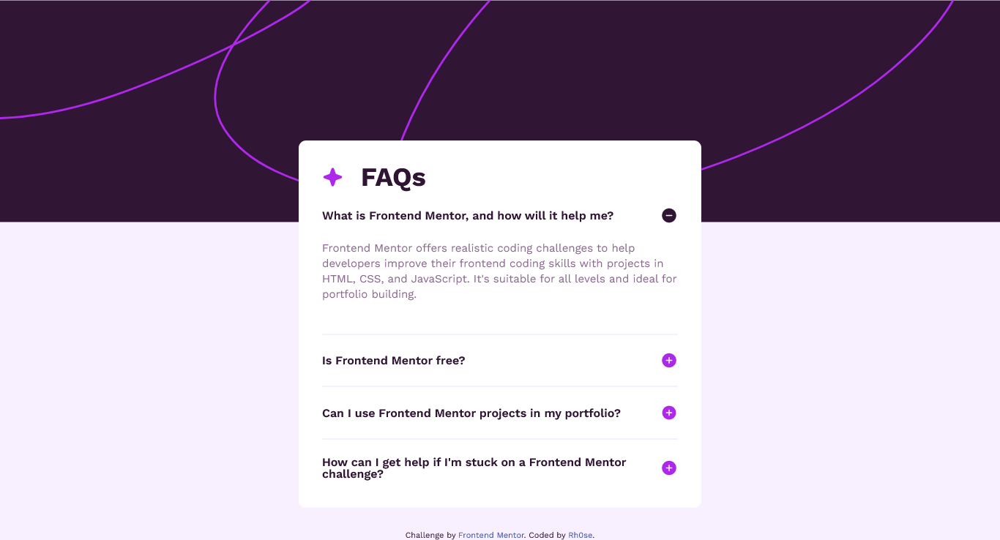

# Frontend Mentor - FAQ accordion solution

This is a solution to the [FAQ accordion challenge on Frontend Mentor](https://www.frontendmentor.io/challenges/faq-accordion-wyfFdeBwBz). Frontend Mentor challenges help you improve your coding skills by building realistic projects. 

## Table of contents

- [Overview](#overview)
  - [The challenge](#the-challenge)
  - [Screenshot](#screenshot)
  - [Links](#links)
- [My process](#my-process)
  - [Built with](#built-with)
  - [What I learned](#what-i-learned)
  - [Continued development](#continued-development)
  - [Useful resources](#useful-resources)
- [Author](#author)


## Overview

### The challenge

Users should be able to:

- Hide/Show the answer to a question when the question is clicked
- Navigate the questions and hide/show answers using keyboard navigation alone
- View the optimal layout for the interface depending on their device's screen size
- See hover and focus states for all interactive elements on the page

### Screenshot




### Links

- Solution URL: [solution URL](https://github.com/rh0se/faq-accordion-main)
- Live Site URL: [live site](https://rh0se.github.io/faq-accordion-main/)

## My process

### Built with

- Semantic HTML5 markup
- CSS custom properties
- Flexbox
- CSS Grid
- Mobile-first workflow


### What I learned

A major thing i learnt is how to use the the details and summary elements. 


```html
<details class="faqs-item" id="question-one" open>
```


### Continued development

- learn more sematic html elements


### Useful resources

- [FreeCodeCamp](https://www.freecodecamp.org/news/nth-child-vs-nth-of-type-selector-in-css/#:~:text=nth%2Dchild()%20selects%20its,%3E%20%2C%20and%20.) - This helped me understand the difference between nth-child() vs nth-of-type() Selectors in CSS.
- [MDN web docs](https://developer.mozilla.org/en-US/docs/Web/HTML/Element/details) and [web.dev](https://web.dev/learn/html/details) This helped me understand the details and summary elements


## Author

- Linkedin - [Rhoda](https://www.linkedin.com/in/rhoda-ojetola)
- Twitter - [@NerdySimi](https://twitter.com/NerdySimi)
- Frontend Mentor - [@Rhoda](https://www.frontendmentor.io/profile/rh0se)

